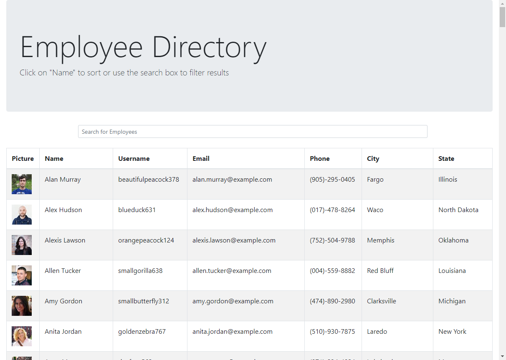
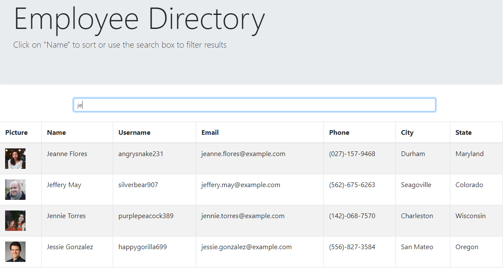

# React Employee Directory
[](https://opensource.org/licenses/MIT)

## Description
A web page created with React that will display random users via an axios API call. The results are displayed in a table. The "Name" header column will before a sort. Click once for descending and twice for ascending. There is a search bar at the top which will filter the results based on first name in the table based on user input. Refreshing the page or hitting enter in the search field will perform another API call and a new list of users will be displayed.

## Table of contents
* [Installation](#installation)
* [Screenshots](#screenshots)
* [License](#license)
* [Contributing](#contributing)
* [Tests](#tests)
* [Questions](#questions)
        
## Installation
To install necessary dependencies, run the following command:
```
npm i
```

## Screenshots

Filtered Results


## License 
This project is licensed under the MIT license.

## Tests
To run tests, run the following command:
```
npm test
```

## Questions
If you have any questions about this repository, open an issue or contact me directly at megtej@gmail.com. You can find more of my work at [mslee001](https://github.com/mslee001).